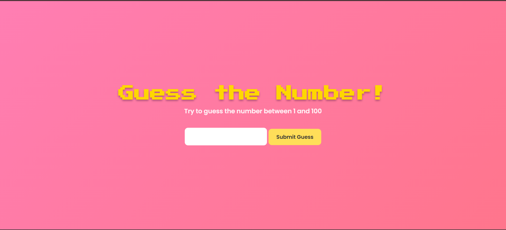

# 🎮 Guess-The-Number-Game

**A fun, Flask-based game where you guess a number between 1 and 100!**  
Live Demo 👉 [Play Now](https://guess-the-number-game-krez.onrender.com/)



---

## 🚀 About the Project

The **Guess-The-Number Game** is a web-based application built with **Flask** where players guess a randomly generated number. For each guess, the app provides real-time feedback to help players reach the correct answer.

### 🎯 Key Features
- 🔢 **Random Number Generation**: A number between 1-100 is generated every game.
- 📊 **Instant Feedback**: Receive "Too High" or "Too Low" hints for each guess.
- 🎨 **Simple & Interactive UI**: Clean design for an enjoyable user experience.
- 🧪 **Lightweight & Fast**: Runs efficiently with Flask and minimal resources.

---

## 🛠️ Tech Stack

- **Backend**: Python (Flask)
- **Frontend**: HTML, CSS
- **Hosting**: Render

---

## 🎮 How to Play

1. Open the live app 👉 [Guess-The-Number Game](https://guess-the-number-game-krez.onrender.com/)
2. Enter a number between 1 and 100.
3. Receive hints after each guess:
   - 🔼 "Too High" if your guess is above the number.
   - 🔽 "Too Low" if your guess is below the number.
4. Keep guessing until you find the correct number! 🎉

---

## 📸 Screenshot


---

## 💻 Run the Project Locally

1. **Clone the Repository**
   ```bash
   git clone https://github.com/negarprh/Guess-The-Number-Game.git
   cd Guess-The-Number-Game
   ```

2. **Set Up a Virtual Environment**
   ```bash
   python -m venv venv
   source venv/bin/activate  # For Linux/Mac
   venv\Scripts\activate     # For Windows
   ```

3. **Install Dependencies**
   ```bash
   pip install -r requirements.txt
   ```

4. **Run the Application**
   ```bash
   python main.py
   ```

5. **Visit the Local App**
   Open your browser and go to `http://127.0.0.1:5000`.

---

## 📂 Project Structure

```bash
Guess-The-Number-Game/
├── static/            # CSS and static assets
├── templates/         # HTML templates
├── main.py            # Main Flask app
├── requirements.txt   # Python dependencies
├── README.md          # Project README
└── websiteScreenshot.png  # App screenshot
```

---

## 🤝 Contributing

Contributions are welcome! Here's how you can help:
1. Fork this repository.
2. Create a feature branch.
3. Submit a pull request with detailed explanations of changes.

---

## 📧 Contact

- **Author**: [negarprh](https://github.com/negarprh)
- **Email**: negarpr@hotmail.com

If you enjoyed this project, don't forget to ⭐ the repository and share it! 😊

---

## 🌟 Play the Game

Ready to test your luck?  
👉 **[Play Now](https://guess-the-number-game-krez.onrender.com/)** 🎉

---

Let me know if you'd like further refinements or additional sections! 🚀
